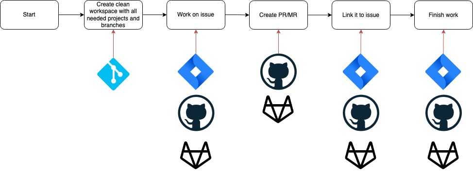

# issuectl


[](LICENSE)

[](https://goreportcard.com/report/github.com/janekbaraniewski/issuectl)
[](https://pkg.go.dev/github.com/janekbaraniewski/issuectl)

> ❗️WIP❗️


**Streamline your work on multiple repositories and issues simultaneously. This tool will:**

- Maintain a clean work directory for each of your issues
- When you start working on new issue it:
  - Clones all repositories you need to separate directory
  - Sets up branches in all repositories
  - Changes status of issue in issue backend to In Progress
- Then it allows you with just one command to:
  - open Pull Request
  - link it to issue
- And when youre done it:
  - cleanes up working directory
  - sets issue to Done

## Install

On macOS:

```bash
➜ brew install janekbaraniewski/janekbaraniewski/issuectl
```

## Quick start

`issuectl init` will create config file with minimal setup to get you going

```bash
➜ issuectl init
? Enter Git user name: John Doe
? Enter Git user email: john@doe.com
? Enter SSH key path: /Users/johndoe/.ssh/id_rsa
? Do you want to configure a backend? Yes
? Select backend type: github
? Enter GitHub Host (Skip for https://api.github.com/):
? Enter GitHub Token: ****************
? Enter GitHub Username: johndoe
? Enter working directory for profile: /Users/johndoe/Workdir
? Enter repository name: my-repo
? Enter repository owner: johndoe
? Enter repository URL: git@github.com:johndoe/my-repo.git
```

To see generated config run

```bash
➜ issuectl config get
currentProfile: default
repositories:
  my-repo:
    name: my-repo
    owner: johndoe
    url: git@github.com:johndoe/my-repo.git
profiles:
  default:
    name: default
    workDir: /Users/johndoe/Workdir
    issueBackend: default
    repoBackend: default
    gituser: John Doe
    repositories:
    - my-repo
    defaultRepository: my-repo
backends:
  default:
    name: default
    backendType: github
    github:
      token: supersecrettoken
      username: johndoe
gitUsers:
  John Doe:
    name: John Doe
    email: john@doe.com
    sshkey: /Users/johndoe/.ssh/id_rsa
```

## Usage

```bash
➜ issuectl --help

issuectl helps managing separate environments for work on multiple issues.

Start work on issue:
	issuectl start [issue_number]

Open PR and link it to issue
	issuectl openpr [issue_number]

Finish work, close the issue
	issuectl finish [issue_number]

Usage:
  issuectl [flags]
  issuectl [command]

Available Commands:
  completion  Generate the autocompletion script for the specified shell
  config      Manage config
  finish      Cleanup resources and close issue
  help        Help about any command
  init        Initialize configuration
  list        List all issues
  openpr      Opens a pull request for the specified issue
  start       Start work on issue
  workon      Open specified issue in the preferred code editor

Flags:
  -h, --help      help for issuectl
  -v, --version   version for issuectl

Use "issuectl [command] --help" for more information about a command.
```

> This is a basic idea of workflow and what systems this can interact with at each step.


### Repositories

In order to work on code you need to define your repositories:

```bash
➜ issuectl config repo add my-org repoName git@github.com:my-org/repoName.git
```

### Backends

You'll also need to configure issue backend. ATM there is GitHub and Jira backend and untested GitLab backend.

```bash
➜ issuectl config backend add --help
Add a new backend

Usage:
  issuectl config backend add [name] [type] [flags]

Flags:
      --github-api string      GitHub API URL (default "https://api.github.com/")
      --github-token string    GitHub API Auth Token
      --gitlab-api string      GitLab API URL
      --gitlab-token string    GitLab API Token
  -h, --help                   help for add
      --jira-host string       Jira API URL
      --jira-token string      Jira API Token
      --jira-username string   Jira API Username
```

Let's configure GitHub backend for our repository:

```bash
➜ issuectl config backend add --github-token mysupersecrettoken my-org-github github
```

And Jira backend for our issues:

```bash
➜ issuectl config backend add --jira-host https://my-org.atlassian.net/ --jira-token "${JIRA_API_TOKEN}" --jira-username "${JIRA_USERNAME}" my-org-jira jira
```

### Git Users

```bash
➜ issuectl config gituser add "John Doe" johndoe@myorg.com /Users/johndoe/.ssh/work
```

### Profiles

Once you've set all of this up, you can create your default profile:

```bash
➜ issuectl config profile add
Usage:
  issuectl config profile add [name] [workdir] [issue backend] [repo backend] [git user] [default repo] [flags]

Flags:
  -h, --help            help for add
  -r, --repos strings   A list of repositories to clone

```

```bash
➜ issuectl profile add -r repoName work /Users/johndoe/Workspace/myorg my-org-jira my-org-github "John Doe" repoName
➜ issuectl use work
```

This will create a profile which will clone `repoName` for each issue. You might want to clone multiple repositories, depending on your environment. For this, run

```bash
➜ issuectl config profile addRepo repoName2
```

This will add `repoName2` to your profile and clone it when starting work on new issue.

### Issues

With all of this in place you can work on issues

#### Start

```bash
➜ issuectl start [issueNumber]
```

#### Open PR

```bash
➜ issuectl openpr [issueNumber]
```

#### Finish

```bash
➜ issuectl finish [issueNumber]
```
