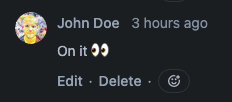
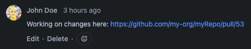
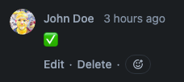

# issuectl


[](LICENSE)

[](https://goreportcard.com/report/github.com/janekbaraniewski/issuectl)
[](https://pkg.go.dev/github.com/janekbaraniewski/issuectl)

Streamline your work with multiple repositories, issues and git accounts simultaneously. This tool will
----

- Maintain a clean work directory for each of your issues using defined by you combination of `RepositoryBackend` (`GitLah`, `GitHub`, ...), `IssueBackend` (`Jira`, `GitHub`, `GitLab`, ...) and `GitUser`
- When you start working on new issue it:
  - Clones all repositories you need to separate directory
  - Sets up branches in all repositories
  - Changes status of issue in issue backend to In Progress
- Then it allows you with just one command to:
  - open Pull Request
  - link it to issue
- And when youre done it:
  - cleanes up working directory
  - sets issue to Done

## Install

On macOS:

```bash
➜ brew install janekbaraniewski/janekbaraniewski/issuectl
```

## Quick start

`issuectl init` will create config file with minimal setup to get you going

```bash
➜ issuectl init
? Enter Git user name: John Doe
? Enter Git user email: john@doe.com
? Enter SSH key path: /Users/johndoe/.ssh/id_rsa
? Do you want to configure a backend? Yes
? Select backend type: github
? Enter GitHub Host (Skip for https://api.github.com/):
? Enter GitHub Token: ****************
? Enter GitHub Username: johndoe
? Enter working directory for profile: /Users/johndoe/Workdir
? Enter repository name: my-repo
? Enter repository owner: johndoe
? Enter repository URL: git@github.com:johndoe/my-repo.git
```

To see generated config run

```bash
➜ issuectl config get
currentProfile: default
repositories:
  my-repo:
    name: my-repo
    owner: johndoe
    url: git@github.com:johndoe/my-repo.git
profiles:
  default:
    name: default
    workDir: /Users/johndoe/Workdir
    issueBackend: default
    repoBackend: default
    gituser: John Doe
    repositories:
    - my-repo
    defaultRepository: my-repo
backends:
  default:
    name: default
    backendType: github
    github:
      token: supersecrettoken
      username: johndoe
gitUsers:
  John Doe:
    name: John Doe
    email: john@doe.com
    sshkey: /Users/johndoe/.ssh/id_rsa
```

## Usage

`issuectl` allows you to

### Start

```bash
➜ issuectl start [issueNumber]
```

```bash
➜ issuectl start XY-321
    🏗️	Preparing workspace for issue XY-321...
    🛬	Cloning repositories [my-secret-project]
    🫡	Marking issue as In Progress in my-org-jira
    🚀	Workspace for XY-321 ready!
    🧑‍💻	Run `issuectl workon XY-321` to open it in VS Code
```

This will:

- create a new work directory for your issue
- clone all repositories defined in active profile to issue work dir
- setup branches in those repositories
- move issue to In Progress state
- leave a comment under issue:



---

### List

List all your in progress issues simply by running

```bash
➜ issuectl list
ID    Name                      Repository Backend Issue Backend Branch                    Repositories    Profile
XY-69 XY-69-test-task-from-jira github-priv        my-org-jira   XY-69-test-task-from-jira [myRepo]        work
44    44-test-task-from-github  github-priv        github-priv   44-test-task-from-github  [myPrivProject] priv
```

---
### Work

```bash
➜ issuectl workon [issueNumber]
```

This will open issue directory in your code editor (WARNING! ATM VSCODE IS HARDCODED)

----

### Open PR

```bash
➜ issuectl openpr [issueNumber]
```
```bash
➜ issuectl openpr XY-321
    📂	Opening PR for issue XY-321 in my-org/my-project [github-work]
    🔗	Linking PR 321 to issue XY-321 in jira-work
```

This will:

- create a Pull Request in `RepositoryBackend`
- leave a comment under issue:



---

### Finish

```bash
➜ issuectl finish [issueNumber]
```
```bash
➜ issuectl finish XY-321
    🥂	Finishing work on XY-321
    🏁	Closing issue XY-321 in jira-priv
    🧹	Cleaning up issue workdir
    🫥	Removing issue config
    👍	All done!
```


This will:

- delete issue work dir
- move issue to `Done` state
- leave a comment under issue:


---

### Cool syntax!!!

If you want, you can add alias you tour .bashrc/.zshrc:

```bash
alias i=issuectl
```

this will make your interaction with CLI more natural! Check this out:

```bash
➜ i start OPS-123
    🏗️	Preparing workspace for issue OPS-123...
    🛬	Cloning repositories [my-secret-project]
    🫡	Marking issue as In Progress in my-org-jira
    🚀	Workspace for OPS-123 ready!
    🧑‍💻	Run `issuectl workon OPS-123` to open it in VS Code
```

```bash
➜ i workon OPS-123
```

```bash
➜ i openpr OPS-123
    📂	Opening PR for issue OPS-123 in janekbaraniewski/issuectl [github-priv]
    🔗	Linking PR 321 to issue OPS-123 in jira-priv

```

```bash
➜ i finish OPS-123
    🥂	Finishing work on OPS-123
    🏁	Closing issue OPS-123 in jira-priv
    🧹	Cleaning up issue workdir
    🫥	Removing issue config
    👍	All done!
```

> This is a basic idea of workflow and what systems this can interact with at each step.


## Configuration

```bash
➜ issuectl --help

issuectl helps managing separate environments for work on multiple issues.

Start work on issue:
	issuectl start [issue_number]

Open PR and link it to issue
	issuectl openpr [issue_number]

Finish work, close the issue
	issuectl finish [issue_number]

Usage:
  issuectl [flags]
  issuectl [command]

Available Commands:
  completion  Generate the autocompletion script for the specified shell
  config      Manage config
  finish      Cleanup resources and close issue
  help        Help about any command
  init        Initialize configuration
  list        List all issues
  openpr      Opens a pull request for the specified issue
  start       Start work on issue
  workon      Open specified issue in the preferred code editor

Flags:
  -h, --help      help for issuectl
  -v, --version   version for issuectl

Use "issuectl [command] --help" for more information about a command.
```

### Repositories

In order to work on code you need to define your repositories:

```bash
➜ issuectl config repo add \
    my-org \
    repoName \
    git@github.com:my-org/repoName.git
```

### Backends

You'll also need to configure issue backend. ATM there is GitHub and Jira backend and untested GitLab backend.

```bash
➜ issuectl config backend add --help
Add a new backend

Usage:
  issuectl config backend add [name] [type] [flags]

Flags:
      --github-api string      GitHub API URL (default "https://api.github.com/")
      --github-token string    GitHub API Auth Token
      --gitlab-api string      GitLab API URL
      --gitlab-token string    GitLab API Token
  -h, --help                   help for add
      --jira-host string       Jira API URL
      --jira-token string      Jira API Token
      --jira-username string   Jira API Username
```

Let's configure GitHub backend for our repository:

```bash
➜ issuectl config backend add \
    --github-token mysupersecrettoken \
    my-org-github \
    github
```

And Jira backend for our issues:

> Please remember you have to use Jira with language set to English (US)

```bash
➜ issuectl config backend add \
    --jira-host https://my-org.atlassian.net/ \
    --jira-token "${JIRA_API_TOKEN}" \
    --jira-username "${JIRA_USERNAME}" \
    my-org-jira \
    jira
```

### Git Users

```bash
➜ issuectl config gituser add \
    "John Doe" \
    johndoe@myorg.com \
    /Users/johndoe/.ssh/work
```

### Profiles

Once you've set all of this up, you can create your default profile:

```bash
➜ issuectl config profile add
Usage:
  issuectl config profile add [name] [workdir] [issue backend] [repo backend] [git user] [default repo] [flags]

Flags:
  -h, --help            help for add
  -r, --repos strings   A list of repositories to clone

```

```bash
➜ issuectl config profile add \
    -r repoName \
    work \
    /Users/johndoe/Workspace/myorg \
    my-org-jira \
    my-org-github \
    "John Doe" \
    repoName

➜ issuectl config profile use work
```

This will create a profile which will clone `repoName` for each issue. You might want to clone multiple repositories, depending on your environment. For this, run

```bash
➜ issuectl config profile addRepo repoName2
```

This will add `repoName2` to your profile and clone it when starting work on new issue.
